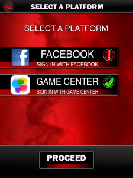

[] When I heard there was a digital CCG coming out in the WWE universe...I was confused more than anything. After hearing that WWE SuperCard ([iTunes](https://itunes.apple.com/us/app/wwe-supercard/id775402833?mt=8), [Play](https://play.google.com/store/apps/details?id=com.catdaddy.cat22&hl=en)) [was downloaded 1.5 million times](http://www.joystiq.com/2014/08/25/wwe-supercard-superkicks-1-5-million-downloads/) in the first week and a half of being available, I knew I had to give it a shot (for science!). After two days and some sore thumbs, I can see why it's so popular.

But before a CCG can start hooking players into that sweet, sweet drip of new cards, it has to get players in the game first. Lets take a look at what all of those 1.5 million players had to get through before their first match in WWE SuperCard!

[] 
## 1) Title Screen

The game starts out like so many others with a title screen that doesn't offer much. This is where the Options menu lives.

[]
## 2) Select Platform

Here, the onboarding process starts officially with the account creation process. I'm not sure what the Android version looks like, but the iOS version offers Facebook and Game Center logins. Having a Game Center login is really awesome, because that means I basically never have to login again, AND I don't have to create another one-off account that I need a password for.

Of course, I need Game Center to work reliably, which maybe is a sketchy proposition. But for the moment, it's working out just fine.

[]
## 3) Enter Name

Here, WWE SuperCard very ambiguously asks for a name. This is one of those situations where I'd like a little bit more information before I can confidently put an answer in the box. In the context of a CCG, is the game really asking for my actual name, or is it more of a handle/username? Can I change it later? All questions that make me a little nervous about what to put in the box.

Okay, this isn't a huge deal. But it's definitely something that caused me to think twice.

[]
## 4) Starting Cards

At this point, WWE SuperCard makes like its name and gives you a starting deck of cards. It's a bit of a slow process - each card in your deck is displayed one at a time, with a bit of an explosion, and a zooming in animation. This level of drama probably makes sense - this is a card battling game after all, and your deck is the entire point. But at the same time it's a little weird, because as the cards flash onto the screen, none of the stats are really meaningful to the player quite yet, so it's hard to know what to make of what you're seeing.

[]
## 5) Message

After this, I was presented with a message talking about some change in the game. This means absolutely nothing to me as a first-time player, and is entirely unnecessary. Whatever kind of message the game is sending, it sure doesn't seem worth interrupting a new player before they have even gotten started.

[]
## 6) Main Menu

And finally, the game's main menu appears. There are only a couple of things to do here, though the game doesn't ever help the player figure out what to do next. Both the Exhibition and King of the Ring modes do have good tutorials once you get into them, thankfully. But picking one the first time though, is definitely a leap of faith.

Side note: If you stick the Options menu on this screen, you have no need for a title screen. Why does every game need a useless title screen? I don't know.

## Conclusion

I think the onboarding process in WWE SuperCard is fairly mediocre, usability-wise. Sure it could use a few touch-ups, but overall it's at least not offensive (remember [Madden 13 Social](http://thatgamesux.com/madden-nfl-13-social-a-terrible-first-impression/)?). The actual card-battling mechanic is both extremely simple and fairly engaging, but that's another topic for another post.

Now if you'll excuse me, I have some cards to level up...
